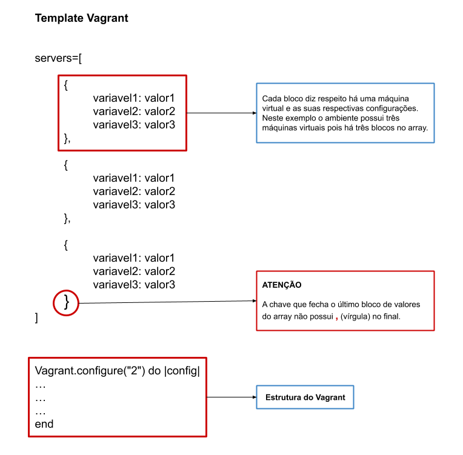

**Montando Ambiente Ansible**

Para facilitar a criação de máquinas virtuais nós utilizaremos o **vagrant** que é uma ferramenta de provisionamento de máquinas virtuais para ambientes de teste. 


**Pré-requisitos:**

- Virtualbox 6.1.6
- Vagrant 2.2.7


**Instalando o Virtualbox**

**OBS:** Este procedimento de instalação é para a distribuição **Linux Mint 19.3**. Caso esteja utilizando o **Ubuntu 20.04** ou o **Fedora 32** a instalação será mais simples pois poderá ser feito via repositório.


**Procedimentos:**

1- Adicione a chave do repositório

```
wget -q https://www.virtualbox.org/download/oracle_vbox_2016.asc -O- | sudo apt-key add -
```

2 - Crie o arquivo **/etc/apt/sources.list.d/virtualbox.list**

```
deb [arch=amd64] https://download.virtualbox.org/virtualbox/debian bionic contrib
```

3 - Atualize o repositório e depois instale o pacote

```
sudo apt-get update
sudo apt-get install virtualbox-6.1
```

4 - Realizado os procedimentos acima o VirtualBox 6.1 será instalado.


**OBS:** Cabe aqui algumas observações, para que a instalação ocorra sem problemas é necessário que os recursos Intel VT-x ou AMD SVM estejam habilitados na BIOS e que o Secure Boot também esteja desabilitado (esse é o caminho mais facil, porém é possível realizar essa instalação com ele habilitado).


**Instalando o Vagrant**

A instalação do vagrant é mais simples que o Virtualbox pois será necessário somente baixar  o pacote de acordo com a distribuição .deb ou .rpm, segue abaixo os link da última versão do vagrant:

DEB
https://releases.hashicorp.com/vagrant/2.2.7/vagrant_2.2.7_x86_64.deb

RPM
https://releases.hashicorp.com/vagrant/2.2.7/vagrant_2.2.7_x86_64.rpm


Para instalar basta executar os comandos abaixo de acordo com a distribuição:

```sh
DEB (Like Debian)
sudo dpkg -i vagrant_2.2.7_x86_64.deb

RMP (Like RHEL)
sudo rpm -Uhv vagrant_2.2.7_x86_64.rpm
```


Uma vez que o Vagrant esteja instalado irei apresentar alguns conceitos básicos sobre a ferramenta para que possamos manipular máquinas virtuais de uma forma mais simples e rápida.


**Estrutura Logica do Vagrant**

<p align="center">
  
</p>


Essa é a estrutura lógica do modelo criado por mim que eu utilizo bastante na criação dos meus ambientes de teste. A estrutura que iremos modificar é o array que possui o conjunto de blocos contendo as informações sobre cada máquina virtual.

Perceba que se desejamos um ambiente com duas máquinas virtuais então teremos dois blocos, se quisermos aumentar a quantidade máquinas basta aumentar a quantidade de blocos o limite é a quantidade de recursos fisicos do host.


**Algumas observações importantes:** 

- O adaptador de rede está configurado no modo bridge ou seja as máquinas terão o mesmo ip que a faixa utilizada pelo host, então tenha cuidado para não definir um IP que já existe em sua rede.
- O usuário padrão da VM é **vagrant** e a senha **123qwe** (NUNCA! use isso em produção rsrs)
- Por simplicidade e preguiça o provisionamento em SHELL desse vagrant está utilizando comandos de instalação Like Debian ou seja imagens Like RHEL irá dar erro nos comandos de provisionamento e não irá instalar os programas essenciais.


**Um pouco mais sobre o Vagrant**

Não irei me aprofundar muito no vagrant somente irei mostrar alguns comandos mais simples para que possamos utiliza-lo de forma satisfátoria em nosso ambiente.

Para mais informações consultar a documentação oficial https://www.vagrantup.com/docs

Antes de começarmos a executar comandos no vagrant é importante que você esteja no mesmo nível que o Vagrantfile ou seja dentro do diretório onde estão sendo executados os comandos do vagrant é necessário que haja o arquivo Vagrantfile caso contrário dará erro. (Outra observação importante é que o nome do arquivo tem que ser exatamente da forma apresentada começando com a primeira letra maiúscula [ **V**agrantfile ] ). 

Eu montei a seguinte estrutura, vocês podem colocar o nome que quiserem isso pouco importa.

```
Invencible -> Diretorio
└── Vagrantfile -> Arquivo
```

**OBS:** Bem complexa essa estrutura rsrs

Uma vez dentro da pasta **Invencible** (no meu caso) vamos ao que interessa!

Comandos Básicos:

- vagrant status - Verifica o status das VMs
- vagrant  up - Inicia a VM
- vagrant halt - Desliga a VM
- vagrant reload - Reinicia a VM
- vagrant ssh - Acessa a VM via SSH
- vagrant destroy - Destroi a VM


**OBS:** O template que eu criei é do tipo Multi-Machine ou seja possui múltiplas VMs configurada dentro de um único template então ao executar por exemplo `vagrant up` sem especificar nenhum host este comando será aplicado em todas as VMs caso deseje ser mais especifico basta informar o host no qual deseja que o vagrant realize a ação por exemplo `vagrant up <hostname>` 

**Ex:** vagrant up vm-01 -> Irá iniciar somente a vm-01   


**Vagrantfile** (Template)

```ruby
#TEMPLATE VAGRANT by IceTux


servers=[
        
        {
                :host_link => "wlp2s0", #Adaptador de rede do host ($ip link)
                :vm_hostname => "master", #Hostname da VM
                :vm_ip => "192.168.1.200", #IP da VM
                :vm_box => "ubuntu/bionic64", #Imagem utilizada na VM - https://app.vagrantup.com
                :vm_mem_size => 512, #Memoria da VM
                :vm_cpu_core => 1, #Quantidade de cores CPUs da VM
                :vbox_name => "Ansible Master", #Nome amigavel para VM (Vitualbox GUI)
                :vbox_group => "/Ansible", #Nome da Pasta que ira agrupar as VMs (Virtualbox GUI)
                :vbox_ostype => "Ubuntu_64", #Icone da VM (Virtualbox GUI)
        },

        {
                :host_link => "wlp2s0", 
                :vm_hostname => "node-01", 
                :vm_ip => "192.168.1.201", 
                :vm_box => "ubuntu/bionic64",
                :vm_mem_size => 512,
                :vm_cpu_core => 1,
                :vbox_name => "Node 01", 
                :vbox_group => "/Ansible",
                :vbox_ostype => "Ubuntu_64",
        },

        {
                :host_link => "wlp2s0", 
                :vm_hostname => "node-02", 
                :vm_ip => "192.168.1.202", 
                :vm_box => "ubuntu/bionic64",
                :vm_mem_size => 512,
                :vm_cpu_core => 1,
                :vbox_name => "Node 02", 
                :vbox_group => "/Ansible",
                :vbox_ostype => "Ubuntu_64",
        },

        {
                :host_link => "wlp2s0", 
                :vm_hostname => "node-03", 
                :vm_ip => "192.168.1.203", 
                :vm_box => "ubuntu/bionic64",
                :vm_mem_size => 512,
                :vm_cpu_core => 1,
                :vbox_name => "Node 03", 
                :vbox_group => "/Ansible",
                :vbox_ostype => "Ubuntu_64",
        }
        
]


Vagrant.configure("2") do |config|

        servers.each do |srv|
                config.vm.define srv[:vm_hostname] do |node|
                        node.vm.box = srv[:vm_box]
                        node.vm.box_check_update = false
                        node.vm.hostname = srv[:vm_hostname]
                        node.vm.network "public_network", ip: srv[:vm_ip], bridge: srv[:host_link]
                        #node.disksize.size = "12GB" #Necessario instalar o plugin vagrant-disksize (vagrant plugin help)

         node.vm.provision "shell", inline: <<-SHELL
           
           #Change Password Vagrant User
           echo 'vagrant:123qwe' | sudo chpasswd

           #Enable SSH Password Connection
           sed -i -r '/#*PasswordAuthentication/d' /etc/ssh/sshd_config
           echo "PasswordAuthentication yes" >> /etc/ssh/sshd_config
           systemctl reload ssh

           apt-get update -qq &> /dev/null

           apt-get install -y &>/dev/null \
           curl \
           wget \
           git \
           vim \
           tmux \
           htop

           echo -e "set ts=2 sw=2 noexpandtab autoindent" >> /home/vagrant/.vimrc
           chown vagrant:vagrant /home/vagrant/.vimrc
           chmod 644 /home/vagrant/.vimrc
            
                SHELL
            
                        node.vm.provider "virtualbox" do |vb|
                                vb.customize ["modifyvm", :id, "--paravirtprovider", "kvm" ]    
                                vb.customize ["modifyvm", :id, "--hwvirtex", "on" ]     
                                vb.customize ["modifyvm", :id, "--nestedpaging", "on" ] 
                                vb.customize ["modifyvm", :id, "--largepages", "on" ]   
                                vb.customize ["modifyvm", :id, "--name", srv[:vbox_name] ]      
                                vb.customize ["modifyvm", :id, "--groups", srv[:vbox_group] ]   
                                vb.customize ["modifyvm", :id, "--description", "VM criada pelo Vagrant" ]      
                                vb.customize ["modifyvm", :id, "--ostype", srv[:vbox_ostype] ]  
                                vb.customize ["modifyvm", :id, "--chipset", "ich9" ]    
                                vb.customize ["modifyvm", :id, "--memory", srv[:vm_mem_size] ]  
                                vb.customize ["modifyvm", :id, "--cpus", srv[:vm_cpu_core] ]
            vb.customize ["modifyvm", :id, "--natdnshostresolver1", "on"]
            vb.customize ["modifyvm", :id, "--ioapic", "on"]
                        end

                end

        end

end 

```


